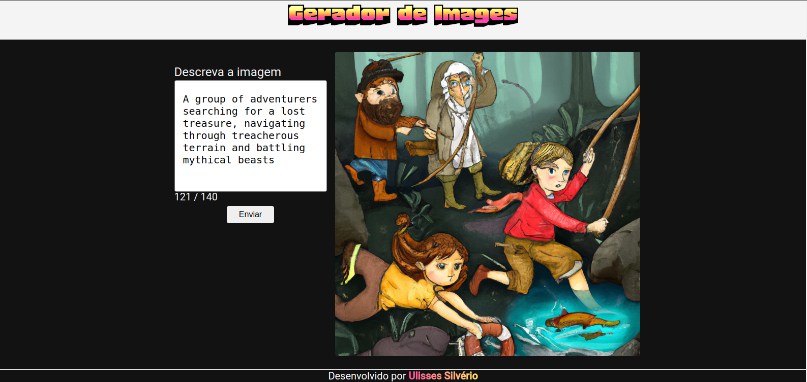

# Gerador de Imagens

Ferramenta criada para gerar imagens aleatórias.



## Tecnologias

- [Angular 17.0.0](https://angular.io/)
- [TypeScript](https://www.typescriptlang.org/)
- [Less](https://lesscss.org/)

## <a id="image-generator-api"></a> Acesso API para gerar a descrição

[Doc](https://github.com/Odisseu93/openai-api)

## Rodar localmente

0. Clone o repositório da API, e execute-o localmente (_siga o passo-a-passo do tópico anterior ["Acesso API para gerar as Imagens"](#image-generator-api)_)

1. Clone este repositório em seu ambiente local:

```bash
git clone https://image-generator.git
```

---

2. Navegue até o diretório do projeto

```bash
cd image-generator
```

---

3. Instale as dependências

```bash
npm start
```

---

4. Rode o servidor localmente

```bash
npm dev
```

5. Seja feliz :-)

## Lincença

[MIT](LICENSE.md)

## Desenvolvedor/Autor

<div align="center">
  
</div>
<br>
<div align="center" margin="50px">
 <a href="https://ulisses.tec.br" align="center">
  <b>Ulisses Silvério</b>
</a>
</div>
